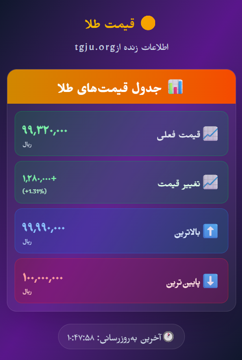

## Overview

This repository contains the browser extension code for “TGJU Gold Extension,” built with WXT and React. This guide explains how to run the extension for development on Chrome and Firefox, how to build release artifacts, and common troubleshooting tips.

## Prerequisites

- Node.js 18 or newer
- npm, pnpm, or yarn (examples use npm)

## Install dependencies

```bash
npm install
```

## Development (Hot Reload)

WXT generates the extension output and auto-reloads in development mode. After you start the command, the output directory path will be printed in the terminal.

- Dev for Chrome:

```bash
npm run dev
```

- Dev for Firefox:

```bash
npm run dev:firefox
```

### Load in Chrome (Developer Mode)

1. Open `chrome://extensions/` in Chrome.
2. Enable “Developer mode”.
3. Click “Load unpacked”.
4. Select the output folder that WXT prints in the terminal (the dev output path). The extension will be installed and will auto-refresh on code changes.

### Load in Firefox (Temporary Add-on)

1. Open `about:debugging#/runtime/this-firefox` in Firefox.
2. Click “Load Temporary Add-on…”.
3. Select the `manifest.json` inside the output folder WXT printed in dev mode. The extension will reload on changes. Note: Temporary add-ons are removed when the browser restarts.

## Production build

- Build for Chrome:

```bash
npm run build
```

- Build for Firefox:

```bash
npm run build:firefox
```

When finished, WXT prints the build output directory in the terminal. You can load that folder with “Load unpacked” in Chrome or package it for store upload.

## Package (Zip) for release

- Zip for Chrome:

```bash
npm run zip
```

- Zip for Firefox:

```bash
npm run zip:firefox
```

The zip files are created at the path reported by WXT and can be uploaded to the respective stores.

## Store submission (high level)

- Chrome Web Store: use the Chrome zip file and follow the Developer Dashboard submission steps.
- Firefox Add-ons (AMO): upload the Firefox zip and follow AMO’s guidelines.

## How to use the extension

1. After installation, pin the extension icon to the toolbar (click the puzzle/Extensions icon and pin it).
2. Click the extension icon to open the popup UI.
3. On supported pages, the content script will activate automatically (grant permissions if prompted).

## UI Preview



## Project structure (quick look)

- `entrypoints/` contains the extension entry points:
  - `background.ts` background script
  - `content.ts` content script
  - `popup/` React popup UI
- `public/` icons and static assets
- `wxt.config.ts` WXT configuration

## Scripts

- `npm run dev`: Development for Chrome
- `npm run dev:firefox`: Development for Firefox
- `npm run build`: Production build for Chrome
- `npm run build:firefox`: Production build for Firefox
- `npm run zip`: Create zip package for Chrome
- `npm run zip:firefox`: Create zip package for Firefox

## Troubleshooting

- Take the output directory path from terminal logs; it may vary with WXT config.
- If “Load unpacked” fails, select a folder that contains a `manifest.json`.
- In Chrome, open Errors from `chrome://extensions/` and check logs.
- In Firefox, check logs in `about:debugging` and the extension console.
- In dev, disable conflicting extensions with similar functionality.
- For Node/npm issues: clear cache and reinstall dependencies (`rm -rf node_modules && npm install`).
- In Firefox, temporary add-ons are removed after restart; reload them each time.

## License

This project is released under the repository’s current license. If there is no license file, add an appropriate license before public distribution.
